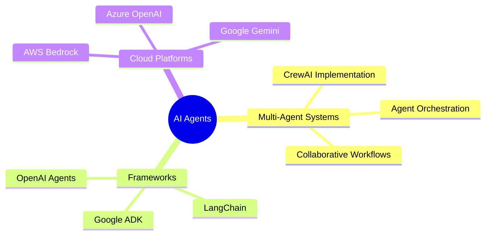

<div align="center">

# 🤖 Hugo Carvalho | AI Agents Leader


</div>

---

<div align="center">

## 🌐 Connect

[](https://www.instagram.com/hugocarvalhop/)
[](mailto:hugosimoes172002@gmail.com)
[](https://linkedin.com/in/seu-perfil)

</div>

---

<div align="center">

## 👨‍💻 About Me

```yaml
🤖 profile:
  name: "Hugo Carvalho"
  role: "AI Agents Leader & Multi-Agent Systems Engineer"  
  location: "Maceió, Alagoas - Brazil 🇧🇷"
  education: "Computer Science & AI at FIAP 🎓"
  focus: "AI Agents, Multi-Agent Systems & Orchestration"
  mission: "Building the future of collaborative AI systems"
  
💡 specialties:
  - Multi-Agent Coordination
  - Autonomous Decision Making
  - Collaborative Intelligence  
  - Agent Orchestration
```

</div>

---

<div align="center">

## 🛠️ Tech Stack

### **🤖 AI Agent Frameworks**


### **🧠 LLM Platforms**


### **💻 Programming & Development**


### **☁️ Cloud & MLOps**


</div>

---

<div align="center">

## 📊 GitHub Analytics


</div>

---

<div align="center">

## 💡 AI Leadership Focus



> *"Building the future of collaborative AI systems"* 🚀

</div>

---

<div align="center">

**Thanks for visiting! 🤖**


</div>
