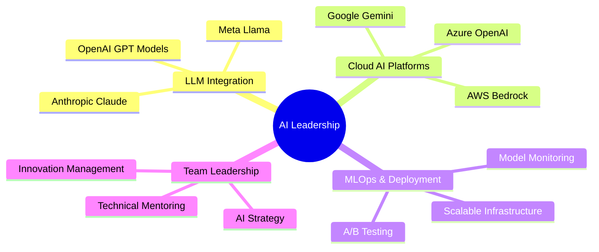

<div align="center">

# 🤖 Hugo Carvalho | AI Leader & Machine Learning Engineer 🚀


</div>

---

<div align="center">
  
## 🌐 **Connect with Me**

[](https://www.instagram.com/hugocarvalhop/)
[](mailto:hugosimoes172002@gmail.com)
[](https://linkedin.com/in/seu-perfil)

</div>

---

<div align="center">

## 🧠 **About Me**

```yaml
name: "Hugo Carvalho"
role: "AI Leader & Machine Learning Engineer"
location: "Maceió, Alagoas - Brazil 🇧🇷"
education: "Computer Science & AI at FIAP 🎓"
specialization: "Artificial Intelligence & Large Language Models"
philosophy: "I never go back on my word! That's my ninja way! 🦊"
mission: "Leading AI transformation and building intelligent systems 🚀"
status: "Always training harder, like a true ninja 📈"
motto: "Believe it! 🦊"
```

</div>

---

<div align="center">

## 🧬 **AI & Machine Learning Stack**

### **🤖 Large Language Models & AI Platforms**


### **🔬 ML Frameworks & Libraries**


### **☁️ Cloud AI & MLOps**


### **💻 Programming & Tools**


### **📊 Data & Analytics**


### **🗄️ Vector Databases & Search**


</div>

---

<div align="center">

## 📊 **GitHub Analytics**


</div>

<div align="center">

## 🔥 **Contribution Streak**


</div>

---

<div align="center">

## 🏆 **GitHub Achievements**


</div>

---

<div align="center">

## 📈 **GitHub Activity Graph**


</div>

---

<div align="center">

## 🐍 **Contribution Snake**


</div>

---

<div align="center">

## 💡 **AI Leadership Focus Areas**



</div>

---

<div align="center">

## 🦊 **Ninja Way Inspiration**

> *"Hard work is necessary. There are no shortcuts to any place worth going."*

> *"If you don't like the hand that fate's dealt you, fight for a new one!"*

> *"When people are protecting something truly special to them, they truly can become as strong as they can be."*

> *"A smile is the best way to get away with trouble even if it's a fake one."*


</div>

---

<div align="center">

### 🚀 **"The AI future belongs to those who believe in their dreams!"** 🦊🤖


---

**Thanks for visiting my AI-focused profile! Believe it! 🦊🙏**


</div>
